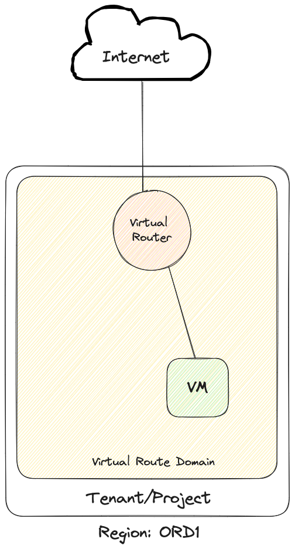

# Simple Instance

This script will create:
-   1 router
-   1 network
-   1 instance
-   1 floating ip
-   1 ssh keypair

[!WARNING]
The SSH keypair generated here can be displayed in the output of `terraform output -json` and is
considered *highly* insecure. The method is provided here for your convenience.



### Create stack

```
terraform apply
```

### Delete stack

```
terraform destroy
```
