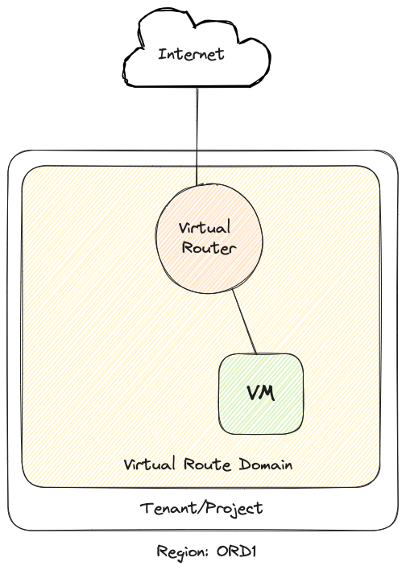

# Simple Instance

This script will create:

-   1 router
-   1 network
-   1 instance
-   1 floating ip
-   1 ssh keypair
-   2 security groups

[!WARNING]
The SSH keypair generated here has been provided here for your convenience. In production,
it is recommended to provide your own public/private keypair.



### Create resources

To create the resources, perform the following commands:

```
terraform apply
```

Example Output:

```
Do you want to perform these actions?
  Terraform will perform the actions described above.
  Only 'yes' will be accepted to approve.

  Enter a value: yes

...

Apply complete! Resources: 15 added, 0 changed, 0 destroyed.

Outputs:

floating_ip = "198.51.100.222"
```

Once created, connect to the instance using the local private SSH key file `sshkey.pem` and the `floating_ip`:.

```
➜  01-simple-instance git:(main) ✗ ssh -i ./sshkey.pem ubuntu@198.51.100.222
The authenticity of host '198.51.100.222 (198.51.100.222)' can't be established.
ED25519 key fingerprint is SHA256:HwqWPZa5Ya/piyC7/I4RaQb9Skvutk4Y+lzOC5w3eYI.
This key is not known by any other names.
Are you sure you want to continue connecting (yes/no/[fingerprint])? yes
Warning: Permanently added '198.51.100.222' (ED25519) to the list of known hosts.
Welcome to Ubuntu 22.04.4 LTS (GNU/Linux 5.15.0-86-generic x86_64)

 * Documentation:  https://help.ubuntu.com
 * Management:     https://landscape.canonical.com
 * Support:        https://ubuntu.com/pro

 System information as of Tue Jun 11 13:19:15 UTC 2024

  System load:  0.0                Processes:             106
  Usage of /:   16.3% of 19.20GB   Users logged in:       0
  Memory usage: 21%                IPv4 address for ens3: 192.168.1.163
  Swap usage:   0%

 * Strictly confined Kubernetes makes edge and IoT secure. Learn how MicroK8s
   just raised the bar for easy, resilient and secure K8s cluster deployment.

   https://ubuntu.com/engage/secure-kubernetes-at-the-edge

Expanded Security Maintenance for Applications is not enabled.

0 updates can be applied immediately.

1 additional security update can be applied with ESM Apps.
Learn more about enabling ESM Apps service at https://ubuntu.com/esm


*** System restart required ***
Last login: Mon Jun 10 16:14:03 2024 from 69.166.65.168
To run a command as administrator (user "root"), use "sudo <command>".
See "man sudo_root" for details.

ubuntu@vm01-lab01:~$
```

### Delete resources

To delete the resources, perform the following commands:

```
terraform destroy
```
